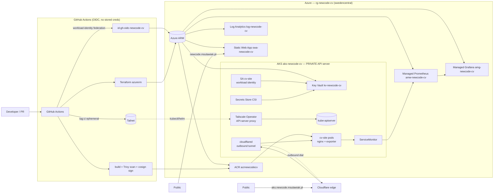

# newcode-devops

**Senior DevOps for production AI infrastructure — the infrastructure in this repo *is* the CV.**

This is a public portfolio repo for a Senior DevOps Engineer targeting [Newcode.ai](https://newcode.ai)
(agentic AI for legal/professional services). Instead of describing skills, the repo *runs* them: an
Azure + AKS + Terraform + Helm + GitHub Actions stack that builds, signs, deploys and observes a real
site — with **zero inbound ports** on the cluster and **zero secret values** committed to a public repo.

The site it serves is my CV/landing page. The interesting part is everything around it.

---

## Architecture



ASCII fallback:

```
GitHub Actions --OIDC--> Azure ARM --Terraform--> {AKS(private), ACR, KeyVault, Managed Prom/Graf, SWA}
GitHub Actions --tag:ci tailnet--> Tailscale Operator API proxy --> private kube-apiserver (kubectl/helm)
build --> Trivy --> cosign sign --> ACR --> AKS pods (nginx + nginx-prometheus-exporter sidecar)
AKS pods --ServiceMonitor--> Managed Prometheus --> Managed Grafana (RED dashboard)
Key Vault --Secrets Store CSI + Workload Identity--> pods (e.g. cloudflared tunnel token)
cloudflared --outbound only--> Cloudflare edge --> aks.newcode.msulawiak.pl
SWA (always-on) --> newcode.msulawiak.pl
```

---

## What is live vs on-demand

| Surface | URL | Backing | Lifecycle |
|---|---|---|---|
| **Always-on front** | `newcode.msulawiak.pl` | Azure Static Web Apps (free tier), Astro static output | Permanent, $0 |
| **On-demand AKS proof** | `aks.newcode.msulawiak.pl` | Same image on private AKS via Cloudflare Tunnel | Spun up on demand, then destroyed; evidence captured in [`docs/evidence/`](docs/evidence/) |

The SWA front is always reachable so the CV never 404s. The AKS path exists to *prove* the full
platform works end-to-end; running it 24/7 burns money for no reason, so the `deploy-aks` workflow
stands the cluster up, captures timestamped proof (kubectl/helm/curl output) into
[`docs/evidence/`](docs/evidence/), and tears it down. The evidence is the artifact, not a running bill.

---

## Zero inbound ports ("no open ports")

The AKS cluster has **no public API endpoint and no inbound listener exposed to the internet**:

- **kube-apiserver is PRIVATE.** CI does not hit a public API. It joins the tailnet ephemerally as
  `tag:ci` and reaches the API server through the **Tailscale Kubernetes Operator's API-server proxy**.
  No public control-plane endpoint, no `0.0.0.0` kubeconfig.
- **App ingress is outbound-only.** `cloudflared` runs in-cluster and *dials out* to the Cloudflare
  edge. There is no LoadBalancer, no public Ingress, no NodePort. Traffic arrives via a tunnel the
  cluster opened, not a port the internet can knock on.

Net result: the only way in is a connection the cluster itself initiated. See [`docs/architecture.md`](docs/architecture.md).

---

## Zero secrets in a public repo

This repo is public and contains **no secret values** — no keys, tokens, passwords, client-ids,
tenant-ids, or subscription-ids. How that holds:

- Azure auth via **GitHub OIDC workload-identity federation** (`id-gh-oidc-newcode-cv`) — no service-principal secrets.
- In-cluster secrets via **Azure Key Vault + Secrets Store CSI Driver + Workload Identity** (`id-cv-app`).
- All other CI secrets referenced only as `${{ secrets.NAME }}`.
- **gitleaks** runs as a pre-commit hook *and* as a CI gate.
- The two highest-leverage actions — `actions/checkout` (runs first in *every* job) and
  `hashicorp/setup-terraform` (the Azure-OIDC / infra-state jobs) — are **pinned by commit SHA**. The
  rest are pinned to **release tags** (never floating `@main`/latest), each marked `# TODO: ratchet to
  SHA`, and **Renovate `pinDigests: true`** (`renovate.json`) opens PRs to convert them to digests. That
  hard-pins the widest-blast-radius and most-privileged actions now, and ratchets the remainder.
- Supply chain is scanned (Trivy) and images **signed with cosign** (keyless/Sigstore).

Full threat model and posture: [`SECURITY.md`](SECURITY.md).

---

## Repo map

| Path | What |
|---|---|
| [`app/`](app/) | Astro static site (the CV) + nginx Dockerfile, served on `:8080`, `/healthz` |
| [`terraform/`](terraform/) | `azurerm` IaC: AKS private, ACR, Key Vault, Managed Prom/Grafana, SWA, OIDC identities. State in `stnewcodecvtf/tfstate/cv.tfstate` |
| [`helm/cv-site/`](helm/cv-site/) | Helm chart: Deployment, Service, HPA, PDB, ServiceMonitor, NetworkPolicy, SA + workload identity, cloudflared, SecretProviderClass |
| [`.github/workflows/`](.github/workflows/) | CI/CD: build+scan+sign, terraform plan/apply, `deploy-aks`, `security-nightly`, Renovate |
| [`grafana/dashboard-red.json`](grafana/dashboard-red.json) | RED dashboard (rate/errors/duration) for Managed Grafana |
| [`docs/`](docs/) | [architecture](docs/architecture.md), [ai-agents](docs/ai-agents.md), [evidence](docs/evidence/) |
| [`SECURITY.md`](SECURITY.md) · [`SLO.md`](SLO.md) · [`CLAUDE.md`](CLAUDE.md) | Posture, service level, working rules |

---

## How to run

Prereqs: an Azure subscription, GitHub repo configured with the OIDC federated identity, and a
Tailscale OAuth client (`tag:ci`). No secrets live in the repo — they're set as GitHub Environment /
Actions secrets and Key Vault entries.

1. **Bootstrap the TF backend** (one-time): creates the `stnewcodecvtf` storage account + `tfstate` container.
   ```bash
   ./scripts/bootstrap-backend.sh
   ```
2. **Provision infra**: review and apply Terraform (run via CI on PR/merge, or locally for the first apply).
   ```bash
   cd terraform && terraform init && terraform plan && terraform apply
   ```
   See [`terraform/terraform.tfvars.example`](terraform/terraform.tfvars.example) for the variables to set.
3. **Deploy the on-demand proof**: trigger the `deploy-aks` workflow (`.github/workflows/deploy-aks.yml`).
   It joins the tailnet, `helm upgrade --install`s the `cv-site` release into namespace `cv`, verifies
   `/healthz`, writes proof into [`docs/evidence/`](docs/evidence/), then destroys the cluster.

Local dev for the site only: see [`app/`](app/) (`npm install && npm run dev`).

---

## JD fit — Newcode.ai

Newcode builds agentic AI for legal/professional services on **Azure + AKS + Terraform + Helm +
GitHub Actions + microservices + IaC**. This repo demonstrates each, against confidential-data constraints:

- **Azure + AKS + IaC**: end-to-end Terraform `azurerm`, private AKS, Managed Prometheus/Grafana.
- **Helm + microservices**: parameterized chart with HPA, PDB, ServiceMonitor, NetworkPolicy.
- **Security for confidential client data**: zero-secret public repo, OIDC, Key Vault + CSI + workload
  identity, zero inbound ports, tenant isolation (`tenant-a`/`tenant-b` namespaces, default-deny NetworkPolicy).
- **Supply chain**: Trivy, cosign keyless signing + verify, SHA-pinned + Renovate-digest-pinned actions, Renovate, dependency-review.
- **Agentic-AI fluency**: an AI-assisted SDLC with a 6-role GitHub agent crew and a nightly AI security
  review — see [`docs/ai-agents.md`](docs/ai-agents.md).

### About me
- **Michał Sulawiak** — Senior Cloud Architect & DevOps / SRE, independent contractor (Poland, remote). 15+ years in production infrastructure; 8+ on Azure, AKS and Terraform.
- Built a governed, multi-tenant agentic-AI platform at **Sky** — security gateway, sandboxed agent runtime, approval-aware tool registry and RAG across Azure / AWS / GCP.
- **Senior Azure Architect & DevOps at PwC** and **Lead Azure Architect & DevOps at Lingaro** — Azure DevOps / GitHub Actions CI/CD, AKS, Terraform, Helm, Ansible, GitOps, FinOps.
- **Microsoft Certified: Azure Solutions Architect Expert** (+ Azure Network Engineer Associate).
- GitHub [`sullson`](https://github.com/sullson) · LinkedIn [michal-sulawiak](https://www.linkedin.com/in/michal-sulawiak)

### Independent delivery

Alongside contracting, I've delivered automation and platform work for a dozen-plus smaller companies —
software houses, businesses automating operations, IT product teams, and my own back office:

- **Multi-agent AI delivery platform** — orchestrator + ephemeral agent containers; gateway-mediated
  side-effects (auth, audit, per-caller allow-lists, isolated egress); a GitHub-driven agent crew
  (Planner / Developer / Reviewer) running Issue → PR → merge.
  *Plain terms: routine coding and ops get done by AI on their own — with a human signing off the important moves.*
- **AI product stack** — chatbot, RAG connectors, MCP integrations, Teams-RAG.
  *Plain terms: a company can ask its own documents and data questions and get straight answers, instead of digging by hand.*
- **GPU inference service** — audio/video transcription + diarization (Whisper / NeMo), GPU deploy via GitHub Actions.
  *Plain terms: hours of audio and video turn into accurate, speaker-labelled text automatically.*
- **Bare-metal GPU server, deployed and AI-operated end to end** — a dual-Blackwell box (2× RTX 6000 Pro / 192 GB VRAM, 64-core Threadripper, ZFS NVMe) on Proxmox with VFIO GPU passthrough, NVIDIA/CUDA + container GPU runtime, Tailscale-only access and Cloudflare-Tunnel ingress; provisioned by Ansible + GitHub Actions, managed via an AI ops workflow.
  *Plain terms: a company's own private AI supercomputer — powerful, fully under its control, and kept running for it.*
- **Product apps with full CI/CD** — e.g. OCR-based invoicing/accounting (Next.js, PostgreSQL, object storage, queues).
  *Plain terms: boring paperwork — like reading and filing invoices — handled automatically.*
- **Infrastructure tooling** — GitOps VM-fleet automation (Ansible + GitHub Actions over Tailscale);
  Terraform-managed Cloudflare edge (DNS / WAF / certs / Zero-Trust tunnels) + NGINX reverse proxy.
  *Plain terms: new servers and websites go live safely in minutes, with nothing done by hand.*
