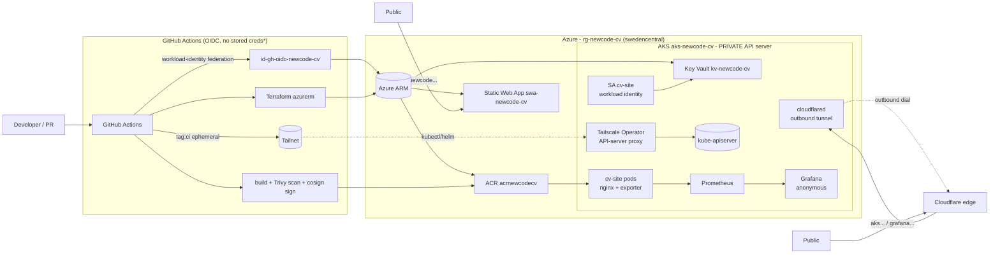

# newcode-devops

**Senior DevOps for production AI infrastructure.**

An Azure + AKS + Terraform + Helm + GitHub Actions stack that builds, signs, deploys and observes a real
site. The cluster is outbound-only and no secret values live in the repo. The site it serves is my CV,
and it's deployed by the pipelines in this repo.

---

## ▶ See it running

The full private-AKS platform runs on weekdays in four 45-minute windows - **10:00, 12:00, 14:00 and
16:00 (Europe/Warsaw)** - then tears itself down. During a window, from any browser, no login:

| | |
|---|---|
| 🟢 **Live app** (on AKS, via Cloudflare Tunnel) | https://aks-newcode.msulawiak.pl |
| 📊 **Live metrics** (in-cluster Grafana, anonymous) | https://grafana-newcode.msulawiak.pl |
| 🟦 **Always-on front** (Azure Static Web Apps, $0) | https://newcode.msulawiak.pl |
| 📁 **Timestamped proof** of each run (cosign + kubectl output) | [`docs/evidence/`](docs/evidence/) |

Outside a window the cluster is gone; the always-on front stays up. Need a window at another time? Ask,
or trigger the `deploy-aks` workflow.

---

## Architecture

`*` the always-on SWA front deploys with a stored SWA token (OIDC isn't a first-class path for SWA
uploads yet); everything on the AKS path is OIDC/keyless. Full walkthrough: [`docs/architecture.md`](docs/architecture.md).

---

## What's in here

| Path | What |
|---|---|
| [`app/`](app/) | Astro static site (the CV) + nginx Dockerfile, `:8080`, `/healthz` |
| [`terraform/`](terraform/) | `azurerm` IaC: private AKS, ACR, Key Vault, Managed Prom/Grafana, SWA, Cloudflare tunnel, OIDC identities |
| [`helm/cv-site/`](helm/cv-site/) | Chart: Deployment, HPA, PDB, ServiceMonitor, NetworkPolicy, workload-identity SA, cloudflared, SecretProviderClass, in-cluster Prometheus + Grafana |
| [`.github/workflows/`](.github/workflows/) | CI (build+scan+sign), `infra` (Terraform), `deploy-aks` (up/down live window), `security-nightly` |
| [`docs/`](docs/) | [status](docs/STATUS.md) · [architecture](docs/architecture.md) · [runbook](docs/RUNBOOK.md) · [ai-agents](docs/ai-agents.md) · [evidence](docs/evidence/) |
| [`SECURITY.md`](SECURITY.md) · [`SLO.md`](SLO.md) | Threat model & posture · service level |

**Outbound-only networking**: the kube-apiserver is private (CI reaches it over Tailscale) and app
traffic arrives through a Cloudflare Tunnel the cluster dials out itself, so nothing on it listens to
the internet. **No secrets in the repo**: Azure via GitHub OIDC, in-cluster secrets via Key Vault + CSI
+ workload identity, gitleaks-gated. The details and the honest demo trade-offs are in
[`SECURITY.md`](SECURITY.md).

---

## About

**Michał Sulawiak** - Senior Cloud Architect & DevOps / SRE, independent contractor (Poland, remote).
15+ years in production infrastructure; 8+ on Azure, AKS and Terraform. Delivered a governed multi-tenant
agentic-AI platform at **Sky**; Senior Azure Architect & DevOps at **PwC**; Lead Azure Architect & DevOps
at **Lingaro**. **Microsoft Certified: Azure Solutions Architect Expert.**

GitHub [`sullson`](https://github.com/sullson) · LinkedIn [michal-sulawiak](https://www.linkedin.com/in/michal-sulawiak)
· full track record on the site above.

To run it yourself from an empty subscription, see [`docs/RUNBOOK.md`](docs/RUNBOOK.md).
